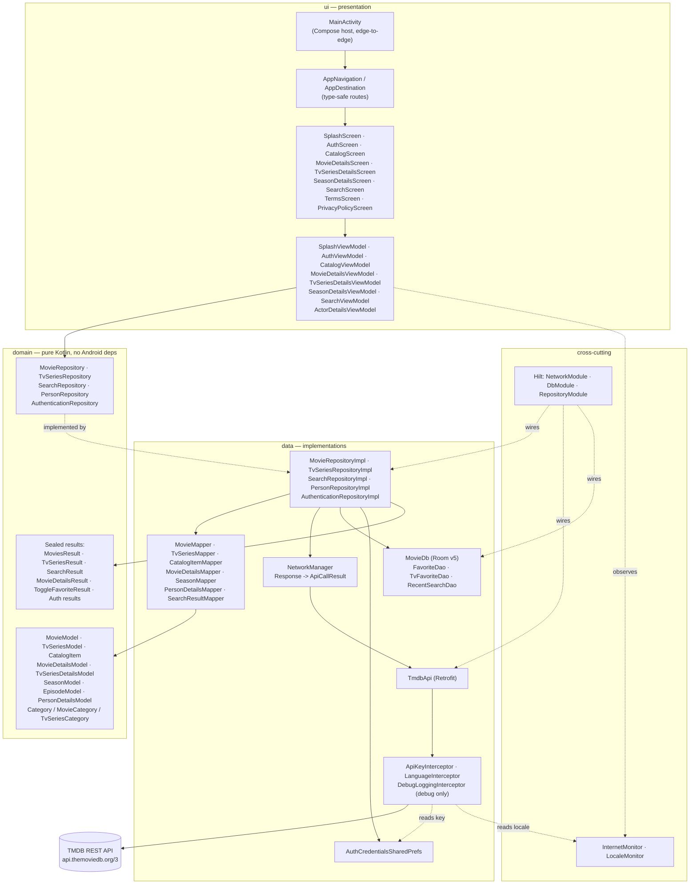
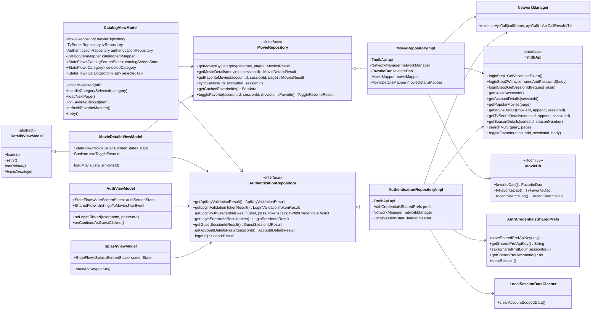
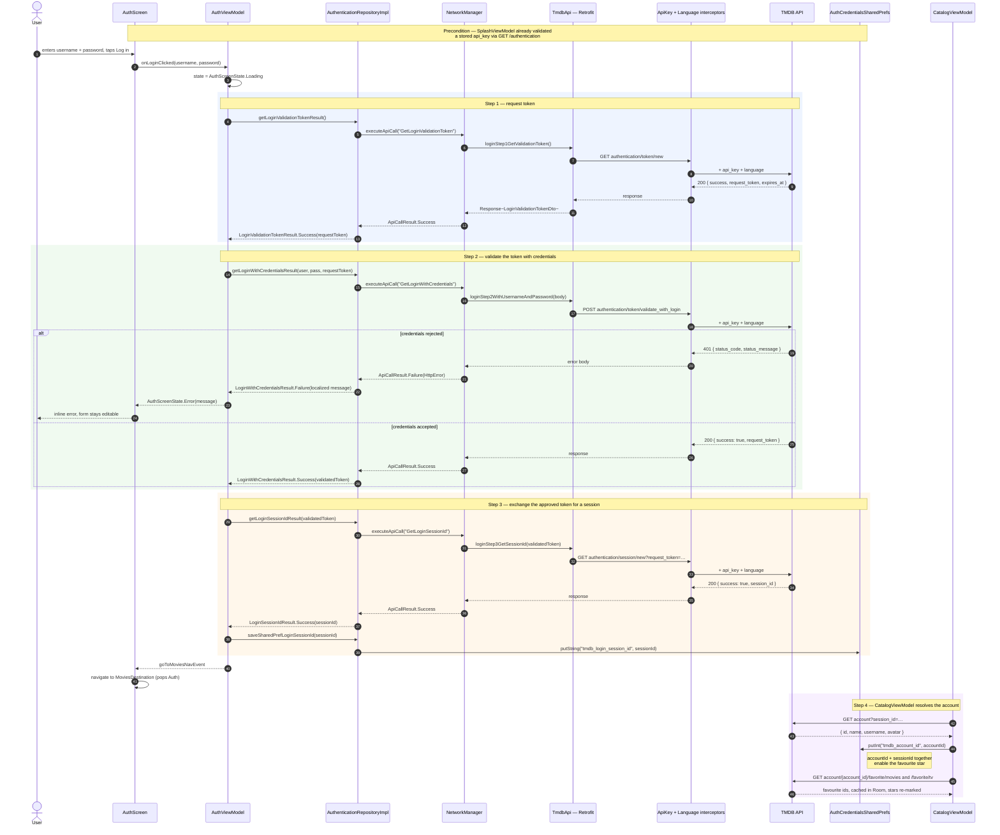
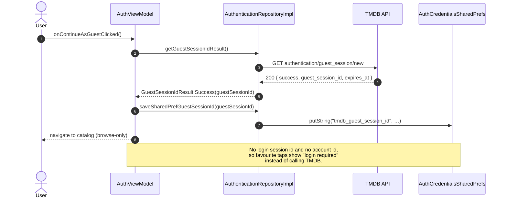

# MMovies

A native Android client for [The Movie Database (TMDB)](https://www.themoviedb.org/) — browse movies, TV series, seasons, episodes and people, built entirely with Jetpack Compose and Clean Architecture.

[](https://developer.android.com/tools/releases/platforms)
[](https://developer.android.com/tools/releases/platforms)
[](https://kotlinlang.org)
[](https://developer.android.com/jetpack/compose)
[](https://openjdk.org/projects/jdk/17/)
[](#license--attribution)
[](#license--attribution)

---

## Overview

MMovies browses TMDB's catalog from a phone: popular / now playing / upcoming / top-rated movies, popular / airing-today / on-the-air / top-rated / upcoming TV series, full details for a title (cast, crew, genres, runtime, user score, trailers), season and episode breakdowns for series, person details, and multi-search across movies, series and people.

Signing in with a TMDB account unlocks server-side favourites — the star on any row or details screen toggles the title in the user's real TMDB favourites list, and the **Favourites** category reads it back. The app can also be used as a guest.

It is built for people who already have (or are willing to create) a free TMDB account and API key: the app ships with no key of its own and no backend of its own. It is not monetised — no ads, no analytics beyond crash reporting, no in-app purchases.

---

## Key Features

Everything below is implemented in the current source tree.

**Browsing**

- **Movies tab** — Popular, Now Playing, Upcoming, Top Rated, Favourites
- **TV Series tab** — Popular, Airing Today, On TV, Top Rated, Upcoming, Favourites
- Each tab remembers its own last-selected category; the selection survives process death via `SavedStateHandle`
- Infinite scroll pagination that appends pages and distinguishes "first page failed" (error screen) from "next page failed" (silently stops the footer spinner)
- Long-press any poster in the list — or on the details screen — for a full-size zoom preview

**Details**

- **Movie details** — backdrop, poster, release date, runtime, genres, user score, overview, cast and crew
- **TV series details** — creators (from TMDB's `created_by`), air-date status label, season list
- **Season details** with per-episode rows, and an **episode details dialog**
- **Actor / person details dialog** reachable from any cast row
- **In-app trailer playback** via the embedded YouTube player, including a fullscreen mode

**Account & favourites**

- Manual username/password login against TMDB's `validate_with_login` flow — a native form, **not** a WebView, so credentials never leave a Compose text field for a browser surface
- **Continue as guest** via TMDB's guest session endpoint
- Favourite star badges on catalog rows and details screens, optimistic on tap and reverted if the API call fails
- Local Room caches of favourite movie / TV ids so stars stay correct across screens; the TMDB API remains the source of truth
- Logout deletes the remote session, clears credentials, and wipes every account-scoped local cache (`LocalSessionDataCleaner`)

**Search**

- Debounced (400 ms) multi-search across movies, TV series and people
- Media-type filter chips
- Recent-search history persisted in Room, individually removable and clearable

**Platform & polish**

- **Multi-language UI** — English, Russian and Hebrew, with `android:supportsRtl="true"` for Hebrew RTL layout
- Language changes at runtime are detected by `LocaleMonitor` and re-fetch the current screen in the new TMDB language
- Dark theme (the app ships a single dark Material 3 colour scheme)
- Connectivity monitoring with dedicated offline states and a shortcut to system network settings
- Terms of Service and Privacy Policy screens, plus a "Powered by TMDB" attribution footer
- API key stored in a private `SharedPreferences` file that is excluded from cloud backup **and** device-to-device transfer

**Not implemented yet**

- **News section** — no news API integration exists in the codebase today. _TODO: document once implemented._
- No light colour scheme; `MMoviesTheme` applies `darkColorScheme` unconditionally.

---

## Screenshots

_TODO: add screenshots._

Drop PNG or WebP captures into `docs/screenshots/` and reference them here. Suggested set and naming:

| File | Screen |
|---|---|
| `docs/screenshots/01-splash.png` | Splash / API key setup |
| `docs/screenshots/02-auth.png` | Login & continue-as-guest |
| `docs/screenshots/03-catalog-movies.png` | Movies catalog with category selector |
| `docs/screenshots/04-catalog-tv.png` | TV series catalog |
| `docs/screenshots/05-movie-details.png` | Movie details with cast and trailer |
| `docs/screenshots/06-tv-season.png` | Season details |
| `docs/screenshots/07-search.png` | Multi-search with filters |
| `docs/screenshots/08-rtl-hebrew.png` | Hebrew RTL layout |

Once the files exist, replace this table with the images:

```markdown
<p align="center">
  
  
  
</p>
```

---

## Tech Stack

All versions below come from [`gradle/libs.versions.toml`](gradle/libs.versions.toml).

| Concern | Choice | Version |
|---|---|---|
| Language | Kotlin | 2.4.0 |
| Build | Android Gradle Plugin / KSP | 9.2.1 / 2.3.9 |
| Java target | JDK 17 (with core library desugaring) | `desugar_jdk_libs` 2.1.5 |
| UI toolkit | Jetpack Compose + Material 3 | Compose BOM 2026.06.01 |
| Architecture | Clean Architecture (`data` / `domain` / `ui`) with MVVM | — |
| UI state | `StateFlow` for screen state, `SharedFlow` for one-shot events | — |
| Async | Kotlin Coroutines + Flow | via AndroidX Lifecycle / Room |
| DI | Hilt (KSP-processed) | 2.60 |
| Navigation | Navigation Compose, type-safe routes via `kotlinx.serialization` | 2.9.8 / json 1.11.0 |
| Networking | Retrofit + Gson converter | 3.0.0 |
| HTTP client | OkHttp + logging interceptor | 5.4.0 |
| Local storage | Room (favourite ids, recent searches) | 2.8.4 |
| Preferences | `SharedPreferences` (API key, session ids, account id) | platform |
| Image loading | Coil 3 (`coil-compose`, `coil-network-okhttp`) | 3.5.0 |
| Animations | Lottie Compose | 6.7.1 |
| Video | `androidyoutubeplayer` core | 13.0.0 |
| Crash reporting | Firebase Crashlytics | BOM 34.15.0 |
| Leak detection (debug) | LeakCanary | 2.14 |
| Extra layout | ConstraintLayout + ConstraintLayout Compose | 2.2.1 / 1.1.1 |

**Testing**

| Layer | Tooling |
|---|---|
| Unit | JUnit 4.13.2, Room testing |
| Instrumented | AndroidX JUnit 1.3.0, Espresso 3.7.0, Compose UI Test, Hilt testing (`HiltTestRunner`) |
| Network | OkHttp MockWebServer + `okhttp-tls` |
| Memory | LeakCanary instrumentation (`MainActivityLeakTest`) |

Release builds enable both `isMinifyEnabled` and `isShrinkResources` with `proguard-android-optimize.txt` plus [`app/proguard-rules.pro`](app/proguard-rules.pro).

---

## TMDB API Key Setup

### What TMDB is, and why a key is required

[The Movie Database (TMDB)](https://www.themoviedb.org/) is a community-maintained database of films, TV series and the people who make them. It exposes a free public REST API, and **every** piece of catalog data, artwork and trailer link in this app comes from it.

TMDB requires each application to identify itself with its own API key, so this repository ships without one — you supply your own. Per TMDB's terms:

> This product uses the TMDB API but is not endorsed or certified by TMDB.

### 1. Get a free key

1. Create an account at [themoviedb.org/signup](https://www.themoviedb.org/signup).
2. Open [themoviedb.org/settings/api](https://www.themoviedb.org/settings/api).
3. Request an API key (the "Developer" option is free). Approval is typically immediate.
4. Copy the value labelled **API Key (v3 auth)** — a 32-character hexadecimal string.

TMDB's own walkthrough lives at [developer.themoviedb.org/docs/getting-started](https://developer.themoviedb.org/docs/getting-started). All three of these URLs are linked from inside the app (see [`NetworkConstants.kt`](app/src/main/java/com/bk/mmovies/data/source/remote/NetworkConstants.kt)).

### 2. Where the key goes

> **Important:** this project does **not** read the key from `local.properties`, `gradle.properties`, or a generated `BuildConfig` field. There is nothing to edit before building, and no `buildConfigField` in [`app/build.gradle.kts`](app/build.gradle.kts).

The key is entered **at runtime, by the user, on first launch**. The splash screen renders `ApiKeySetupView` whenever no key is stored, and `SplashViewModel.saveApiKey()` writes it, validates it against `GET /3/authentication`, and discards it again if TMDB rejects it:

```kotlin
// SplashViewModel.kt
authenticationRepository.saveSharedPrefApiKey(apiKey)
when (authenticationRepository.getApiKeyValidationResult()) {
    is ApiKeyValidationResult.Failure -> {
        authenticationRepository.removeSharedPrefApiKey()   // never keep a bad key
        _invalidApiKeyToastEvent.emit(Unit)
        _screenState.value = SplashScreenState.MissingApiKey
    }
    ApiKeyValidationResult.Success -> loadSplashData()
}
```

Once validated, the key lives in a private `SharedPreferences` file and is appended to every outgoing request as the `api_key` query parameter by `ApiKeyInterceptor`.

<details>
<summary><strong>Storage details and on-device format</strong></summary>

`AuthCredentialsSharedPrefs` owns the file:

| Property | Value |
|---|---|
| Preferences file | `api_key_preferences` (`Context.MODE_PRIVATE`) |
| API key entry | `tmdb_api_key` |
| Session entries | `tmdb_login_validation_token`, `tmdb_login_session_id`, `tmdb_guest_session_id`, `tmdb_account_id` |

The file is excluded from Android's backup and transfer mechanisms in both
[`res/xml/backup_rules.xml`](app/src/main/res/xml/backup_rules.xml) and
[`res/xml/data_extraction_rules.xml`](app/src/main/res/xml/data_extraction_rules.xml):

```xml
<data-extraction-rules>
    <cloud-backup>
        <exclude domain="sharedpref" path="api_key_preferences.xml"/>
    </cloud-backup>
    <device-transfer>
        <exclude domain="sharedpref" path="api_key_preferences.xml"/>
    </device-transfer>
</data-extraction-rules>
```

On disk the entry looks like this (do not copy a real key anywhere it can be committed):

```xml
<map>
    <string name="tmdb_api_key">0123456789abcdef0123456789abcdef</string>
</map>
```

</details>

### 3. Never commit a key

Because the key is never a build input, there is no file in this repository that should ever contain one. If you add a local override for convenience, put it in `local.properties` — already listed in [`.gitignore`](.gitignore) — and never in `gradle.properties`, source, tests, or fixtures. A key that reaches a public commit should be regenerated from the TMDB settings page immediately.

---

## Authentication Flow

The app uses TMDB's **v3 session** authentication. Two paths exist, both driven by `AuthViewModel` → `AuthenticationRepositoryImpl` → `TmdbApi`.

### Signed-in user (username + password)

| Step | Call | Result |
|---|---|---|
| 1 | `GET authentication/token/new` | a short-lived `request_token` |
| 2 | `POST authentication/token/validate_with_login` with `{username, password, request_token}` | the same token, now user-approved |
| 3 | `GET authentication/session/new?request_token=…` | a durable `session_id`, saved to prefs |
| 4 | `GET account?session_id=…` | `accountId`, display name, avatar — `accountId` cached to prefs |

### Guest

`GET authentication/guest_session/new` returns a `guest_session_id`. Guests browse the full catalog, but favourite actions are refused locally with a "login required" message rather than being sent to TMDB.

### Authenticated requests

Subsequent calls are **not** bearer-token requests. Every request carries `api_key` (from `ApiKeyInterceptor`) and `language` (from `LanguageInterceptor`) as query parameters; account-scoped calls additionally pass `session_id` — and, where relevant, the path segment `account/{account_id}` — explicitly:

```
GET  /3/movie/{movie_id}?append_to_response=credits,videos&session_id=…&api_key=…&language=en-US
POST /3/account/{account_id}/favorite?session_id=…&api_key=…
GET  /3/account/{account_id}/favorite/movies?session_id=…&sort_by=created_at.asc
```

Passing `session_id` on a details call is what makes TMDB include `account_states`, i.e. whether the current user has favourited that title.

### Logout

`AuthenticationRepositoryImpl.logout()` sends `DELETE authentication/session` with the session id in the body, then clears the credential prefs **and** every account-scoped local cache (favourite movie ids, favourite TV ids, recent searches) so the next account does not inherit the previous one's stars or search history.

---

## Architecture

### Layers and dependency direction



### Core business-logic classes



### Login sequence



<details>
<summary><strong>Guest session — alternate path</strong></summary>



</details>

---

## Getting Started

### Prerequisites

- **Android Studio** — a version supporting AGP 9.2.1
- **JDK 17**
- An Android device or emulator running **API 23 (Android 6.0)** or newer
- A free **TMDB API key** — see [TMDB API Key Setup](#tmdb-api-key-setup)

### Build and run

```bash
git clone https://github.com/BorisKunda/ComposeTMDB.git
cd ComposeTMDB
```

1. Open the project in Android Studio and let Gradle sync (the wrapper pins the correct Gradle version).
2. Run the `app` configuration on a device or emulator — **no key is needed to build.**
3. On first launch the splash screen asks for your TMDB API key. Paste it and tap **Save and continue**; the app validates it against `GET /3/authentication` before storing it.
4. Either log in with your TMDB username and password, or tap **Continue as guest**.

Or from the command line:

```bash
./gradlew assembleDebug        # build the debug APK
./gradlew installDebug         # build and install on a connected device
./gradlew testDebugUnitTest    # JVM unit tests
./gradlew connectedDebugAndroidTest   # instrumented tests (device/emulator required)
```

> On Windows use `gradlew.bat` in place of `./gradlew`.

### Firebase

The repository includes an `app/google-services.json` for Crashlytics. Replace it with your own Firebase project's file if you fork this and want crash reports of your own.

---

## Project Structure

```
MMovies/
├── app/
│   ├── build.gradle.kts                     # module config: SDK levels, dependency groups
│   ├── proguard-rules.pro                   # R8 rules for the minified release build
│   ├── google-services.json                 # Firebase / Crashlytics config
│   └── src/
│       ├── main/
│       │   ├── AndroidManifest.xml          # INTERNET permission, RTL support, backup rules
│       │   ├── java/com/bk/mmovies/
│       │   │   ├── app/                     # Application class, Coil ImageLoader factory
│       │   │   ├── connectivity/            # InternetMonitor, network-settings helper
│       │   │   ├── locale/                  # AppLanguage enum, LocaleMonitor
│       │   │   ├── di/                      # Hilt modules: Network, Db, Repository
│       │   │   ├── domain/
│       │   │   │   ├── model/               # Framework-free models + sealed results
│       │   │   │   └── repository/          # Repository contracts
│       │   │   ├── data/
│       │   │   │   ├── mapper/              # DTO → domain model mappers, label formatters
│       │   │   │   ├── repositoryimpl/      # Contract implementations
│       │   │   │   └── source/
│       │   │   │       ├── remote/          # TmdbApi, DTOs, interceptors, NetworkManager
│       │   │   │       └── local/           # Room db/dao/entities, SharedPreferences
│       │   │   ├── ui/
│       │   │   │   ├── activity/            # MainActivity (single-activity Compose host)
│       │   │   │   ├── navigation/          # AppDestination routes, AppNavigation graph
│       │   │   │   ├── component/           # Reusable composables (star, loader, trailer…)
│       │   │   │   ├── screen/              # One package per screen: UI + ViewModel + previews
│       │   │   │   └── theme/               # Colours, typography, dimens, preview devices
│       │   │   └── util/                    # Logging helpers and shared utilities
│       │   └── res/
│       │       ├── values/                  # Default (English) strings, colours, themes
│       │       ├── values-ru/               # Russian strings
│       │       ├── values-iw/               # Hebrew strings (legacy `iw` qualifier)
│       │       └── xml/                     # backup_rules.xml, data_extraction_rules.xml
│       ├── test/                            # JVM unit tests
│       └── androidTest/                     # Hilt, Room, MockWebServer, Compose UI, LeakCanary
├── gradle/libs.versions.toml                # Single source of truth for versions
├── build.gradle.kts                         # Root plugin declarations
└── settings.gradle.kts
```

Each screen package follows the same shape — for example `ui/screen/catalog/` holds `CatalogScreen.kt`, `CatalogViewModel.kt`, a `screencomponents/` package of stateless composables, and a `preview/` package with default and `localization/ru` + `localization/he` `@Preview`s so RTL and translated layouts can be checked without a device.

---

## Localization

| Language | Resource folder | TMDB language tag | Layout direction |
|---|---|---|---|
| English (default) | `res/values/` | `en-US` | LTR |
| Russian | `res/values-ru/` | `ru-RU` | LTR |
| Hebrew | `res/values-iw/` | `he-IL` | RTL |

Notes:

- Hebrew uses the **legacy `iw` qualifier**, which is what Android's resource resolver expects; `AppLanguage.fromLocale()` accepts both `"iw"` and `"he"` because `Locale.getLanguage()` reports either depending on OS version.
- RTL is enabled app-wide via `android:supportsRtl="true"`, and Hebrew previews exist for every screen under each screen's `preview/localization/` package.
- `LanguageInterceptor` rewrites the `language` query parameter on **every** outgoing request from the current app locale — no endpoint hardcodes a language.
- `LocaleMonitor` observes `onConfigurationChanged`, and `CatalogViewModel` / `DetailsViewModel` re-fetch the current screen when the language changes (waiting for connectivity first, since a locale switch often lands while the OS is mid-reconnect).
- API 23 compatibility: `Configuration.locales` only exists from API 24, so `LocaleMonitor` falls back to the deprecated singular `Configuration.locale` below that.

---

## License & Attribution

### TMDB

> This product uses the TMDB API but is not endorsed or certified by TMDB.

All film, TV, person, artwork and trailer metadata is provided by [The Movie Database](https://www.themoviedb.org/) and remains subject to [TMDB's terms of use](https://www.themoviedb.org/terms-of-use) and [API terms](https://www.themoviedb.org/api-terms-of-use). The app surfaces this attribution in-product via `PoweredByTmdbFooter`, and ships Terms of Service and Privacy Policy screens.

The TMDB logo and wordmark are trademarks of TMDB and are used here solely for the attribution their API terms require.

### This project

Copyright © 2026 Boris Kunda. **All rights reserved.**

This repository is published for reference and portfolio purposes. No license is granted to use, copy, modify or redistribute the source code. Viewing and forking within GitHub are permitted by GitHub's Terms of Service; nothing beyond that is.

This applies to the application's own code only — it is separate from the TMDB terms described above, which govern the data, and from the third-party libraries below, which carry their own licenses.

### Other third-party components

Firebase Crashlytics, Coil, Retrofit, OkHttp, Room, Hilt, Lottie, LeakCanary and `android-youtube-player` are each distributed under their own licenses; see [`gradle/libs.versions.toml`](gradle/libs.versions.toml) for the exact coordinates and versions.

---

## Roadmap

- [ ] **News section** — not yet implemented; no news provider is integrated
- [ ] Add screenshots under `docs/screenshots/`
- [ ] Landscape: backdrop not shown, and the zoomed poster does not update
- [ ] Consolidate the per-feature `*Result` sealed interfaces into a shared result type
