# MMovies

A native Android client for [The Movie Database (TMDB)](https://www.themoviedb.org/) — browse movies, TV series, seasons, episodes and people, built with **Jetpack Compose**, **MVVM**, and **Clean Architecture**.

[](https://developer.android.com/tools/releases/platforms)
[](https://developer.android.com/tools/releases/platforms)
[](https://kotlinlang.org)
[](https://developer.android.com/jetpack/compose)
[](https://openjdk.org/projects/jdk/17/)
[](#license--attribution)
[](#license--attribution)

---

## Screenshots

<p align="center">
  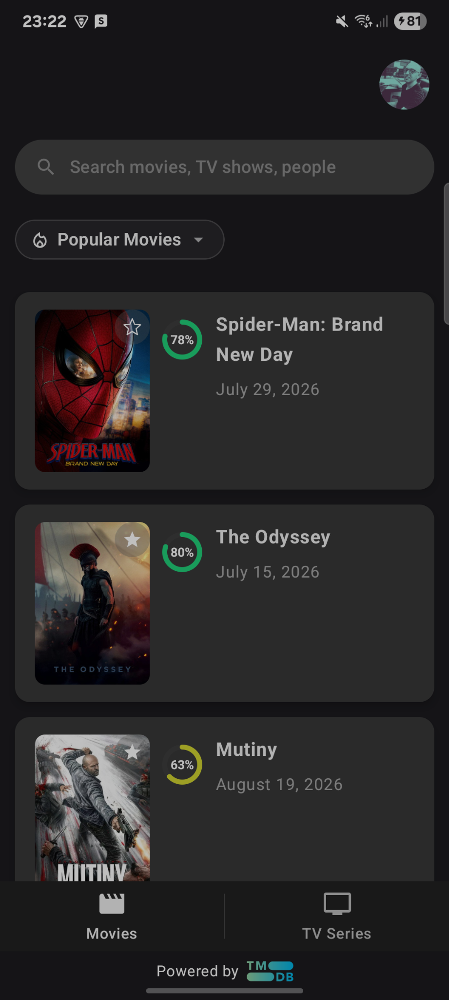
  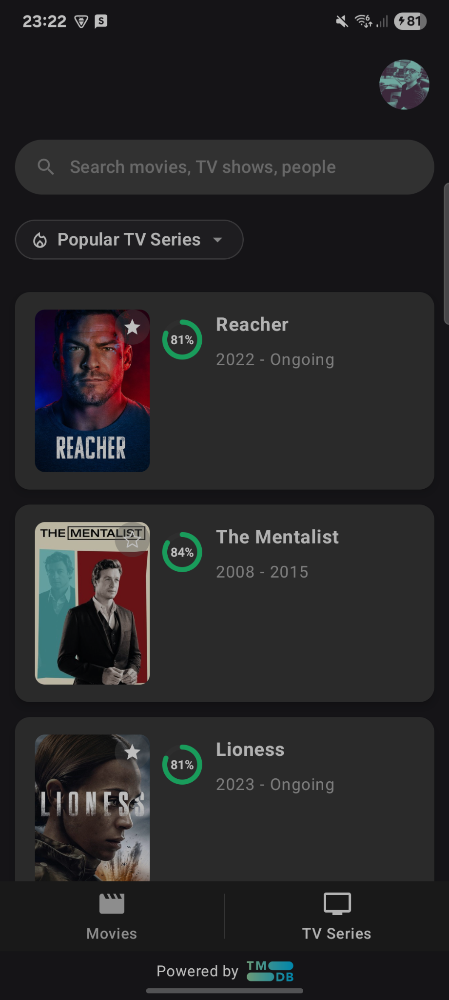
  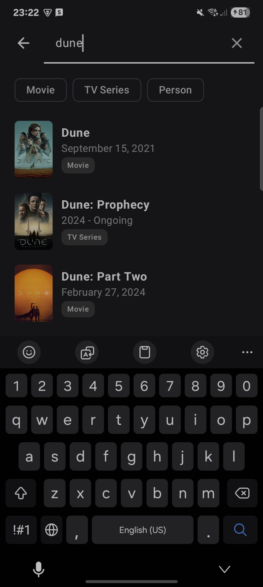
</p>

<p align="center">
  <strong>Movies · TV Series · Multi-search</strong>
</p>

---

## Features

### Movies & TV

- Popular, Now Playing, Upcoming and Top Rated movies
- Popular, Airing Today, On TV, Upcoming and Top Rated TV series
- Infinite-scroll pagination
- Movie and TV-series details
- Seasons and episode information
- Cast, crew and person details
- User scores, genres, runtime and release information
- Full-size poster preview
- In-app YouTube trailer playback with fullscreen support

### Search

- Debounced multi-search across movies, TV series and people
- Media-type filters
- Recent-search history stored locally with Room

### Accounts & Favourites

- Native TMDB username/password authentication
- Guest mode
- Server-side TMDB favourites
- Optimistic favourite updates with automatic rollback on failure
- Local Room cache of favourite IDs
- Account-specific local data cleared on logout

### Platform

- English, Russian and Hebrew
- Full RTL support for Hebrew
- Runtime locale detection and TMDB content reloading
- Dark Material 3 UI
- Connectivity monitoring and dedicated offline states
- Terms of Service and Privacy Policy screens
- TMDB attribution
- Crash reporting with Firebase Crashlytics

---

## Detailed Browsing

MMovies supports navigation from a catalog item all the way down to seasons, episodes and people.

### Movie Details

<p align="center">
  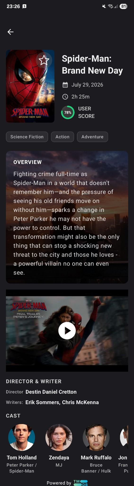
</p>

Movie details include poster artwork, release information, genres, user score, overview, trailer, director and writers, and cast.

### TV Series Details

<p align="center">
  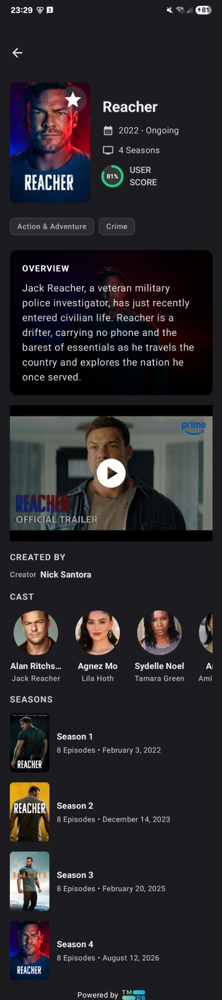
</p>

TV-series details include status, season count, genres, overview, trailer, creators, cast and the complete season list.

### Seasons & Episodes

<p align="center">
  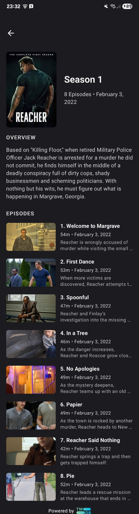
  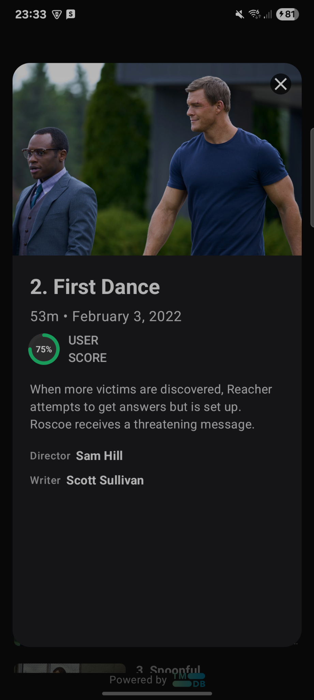
</p>

Each season exposes its episode list, and individual episodes can be opened for additional details.

### Person Details

<p align="center">
  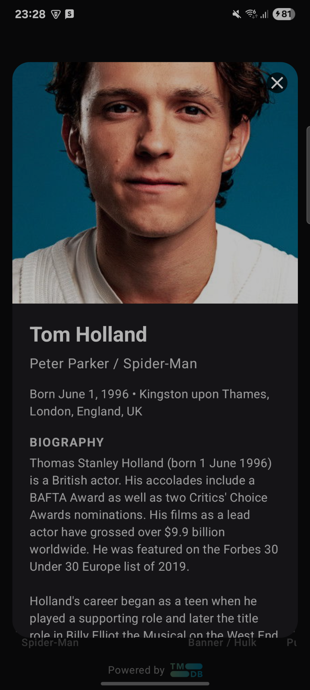
</p>

Cast members can be opened directly from movie and TV-series details to view person information and biography.

---

## Localization

MMovies is available in **English, Russian and Hebrew**.

| Language | Resources | TMDB locale | Direction |
|---|---|---|---|
| English | `values/` | `en-US` | LTR |
| Russian | `values-ru/` | `ru-RU` | LTR |
| Hebrew | `values-iw/` | `he-IL` | RTL |

The current locale is automatically applied to TMDB requests. Changing the application language causes currently displayed remote content to be fetched again using the new locale.

<p align="center">
  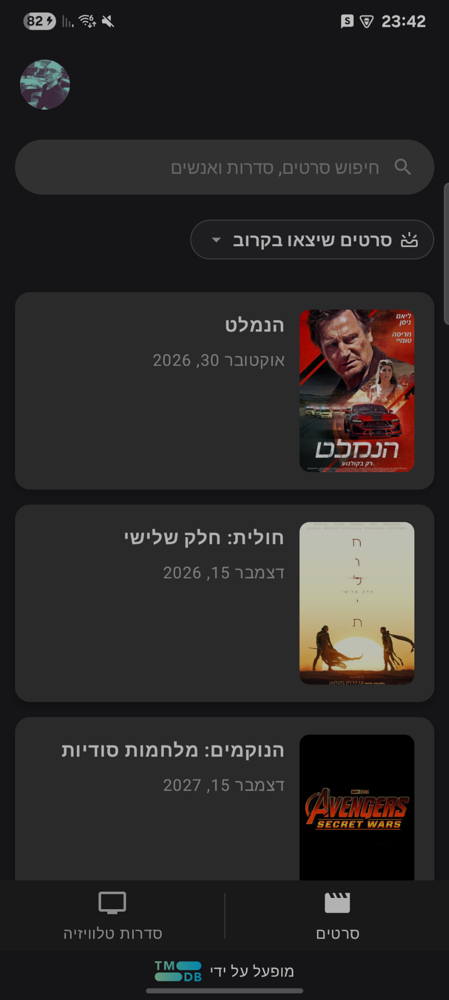
  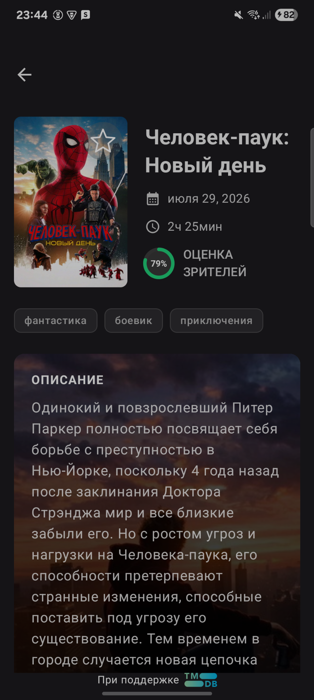
</p>

<p align="center">
  <strong>Hebrew RTL · Russian localization</strong>
</p>

---

## Categories

Movies and TV series each have their own category selector.

<p align="center">
  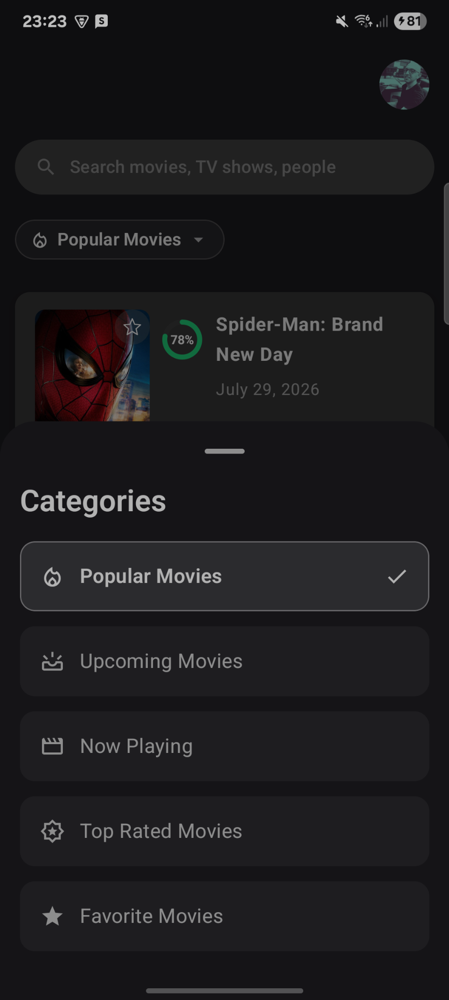
  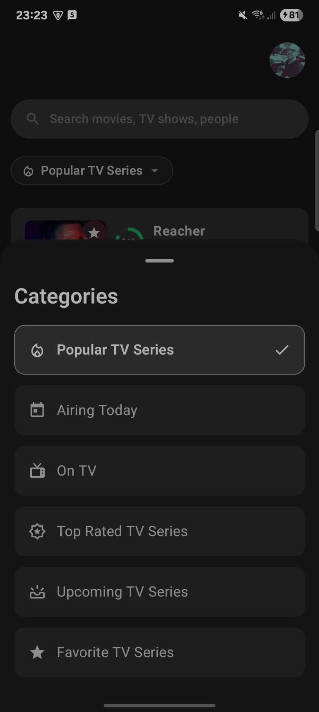
</p>

---

## Tech Stack

| Area | Technology |
|---|---|
| Language | Kotlin 2.4.0 |
| UI | Jetpack Compose + Material 3 |
| Architecture | Clean Architecture + MVVM |
| State | StateFlow / SharedFlow |
| Async | Kotlin Coroutines + Flow |
| Dependency Injection | Hilt |
| Networking | Retrofit 3 + OkHttp 5 |
| Local Database | Room |
| Image Loading | Coil 3 |
| Navigation | Navigation Compose |
| Serialization | kotlinx.serialization |
| Video | android-youtube-player |
| Crash Reporting | Firebase Crashlytics |
| Leak Detection | LeakCanary |
| Testing | JUnit, Espresso, Compose UI Test, MockWebServer |

Release builds use **R8 code shrinking and resource shrinking**.

---

## Architecture

The project follows Clean Architecture with three main layers:

```text
UI
│
├── Screens / Composables
├── ViewModels
│
▼
Domain
│
├── Models
├── Repository interfaces
├── Result types
│
▼
Data
│
├── Repository implementations
├── DTO → domain mappers
├── Retrofit / OkHttp
├── Room
└── SharedPreferences
```

Dependency direction:

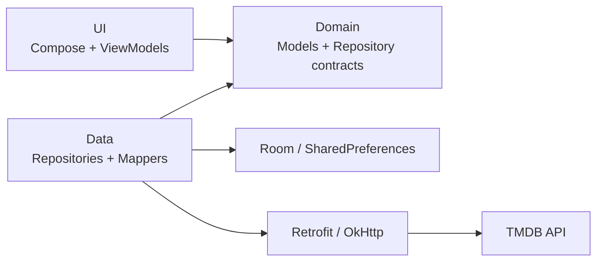

Main repositories include:

- `MovieRepository`
- `TvSeriesRepository`
- `SearchRepository`
- `PersonRepository`
- `AuthenticationRepository`

Cross-cutting services include:

- `InternetMonitor`
- `LocaleMonitor`
- `NetworkManager`
- `ApiKeyInterceptor`
- `LanguageInterceptor`

---

## TMDB API Key

MMovies does **not** contain a bundled TMDB API key.

The user supplies their own free **TMDB API v3 key** when the app starts for the first time.

### Get a key

1. Create a TMDB account at [themoviedb.org/signup](https://www.themoviedb.org/signup).
2. Open [themoviedb.org/settings/api](https://www.themoviedb.org/settings/api).
3. Request a Developer API key.
4. Copy the **API Key (v3 auth)** value.

The app validates the key against TMDB before continuing.

The key is entered at runtime — you do **not** need to modify:

- `local.properties`
- `gradle.properties`
- `BuildConfig`
- source code

The stored credentials file is excluded from Android cloud backup and device-to-device transfer.

> Never commit a real TMDB API key to the repository.

<p align="center">
  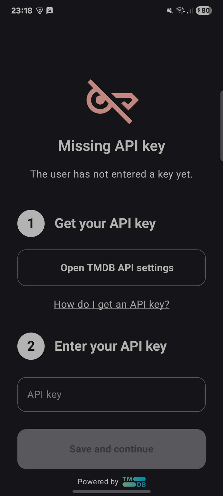
</p>

---

## Authentication

MMovies uses TMDB's **v3 session authentication**.

### Signed-in user

```text
Request Token
      ↓
Validate username + password
      ↓
Create TMDB session
      ↓
Load account
      ↓
Enable account favourites
```

Authentication uses a native Compose login form rather than an embedded WebView.

### Guest

Users can also continue with a TMDB guest session.

Guests have full catalog browsing access, but account favourites require a signed-in TMDB account.

### Logout

Logging out:

- Deletes the TMDB session
- Clears locally stored session credentials
- Clears account-scoped favourite caches
- Clears recent search history

This prevents data belonging to one account from appearing after another account signs in.

<p align="center">
  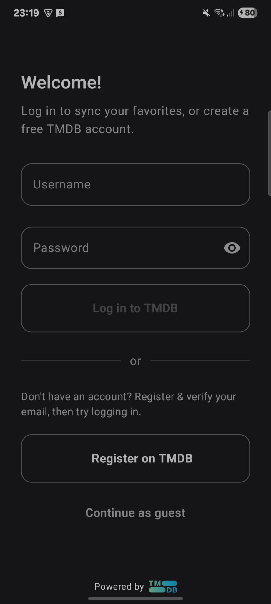
</p>

---

## Getting Started

### Requirements

- Android Studio compatible with AGP 9.2.1
- JDK 17
- Android API 23+
- Free TMDB API key

### Clone

```bash
git clone https://github.com/BorisKunda/MMovies.git
cd MMovies
```

Open the project in Android Studio and let Gradle sync.

No API key is required to compile the project.

On first launch:

1. Enter your TMDB API key.
2. The app validates it.
3. Sign in with your TMDB account or continue as guest.

### Command Line

```bash
./gradlew assembleDebug
./gradlew installDebug
./gradlew testDebugUnitTest
./gradlew connectedDebugAndroidTest
```

On Windows:

```bash
gradlew.bat assembleDebug
```

---

## Project Structure

```text
MMovies/
├── app/
│   └── src/
│       ├── main/
│       │   ├── java/com/bk/mmovies/
│       │   │   ├── app/
│       │   │   ├── connectivity/
│       │   │   ├── locale/
│       │   │   ├── di/
│       │   │   ├── domain/
│       │   │   ├── data/
│       │   │   ├── ui/
│       │   │   └── util/
│       │   └── res/
│       ├── test/
│       └── androidTest/
├── docs/
│   └── screenshots/
├── gradle/libs.versions.toml
├── build.gradle.kts
└── settings.gradle.kts
```

Each feature keeps its UI, ViewModel, screen components and previews together while the domain and data layers remain independent of presentation code.

---

## Firebase

The repository contains `app/google-services.json` for Firebase Crashlytics.

If you fork the project and want your own crash reports, replace it with the configuration file from your own Firebase project.

---

## Additional Screens

All screenshots are stored under [`docs/screenshots/`](docs/screenshots/).

<details>
<summary><strong>Guest mode and legal screens</strong></summary>

<br>

<p align="center">
  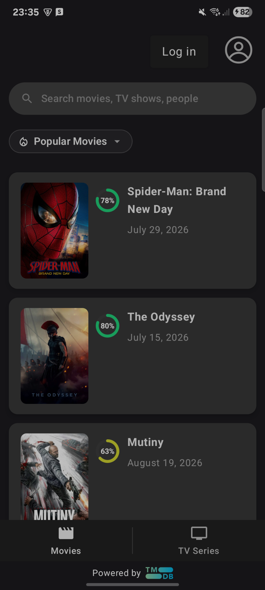
  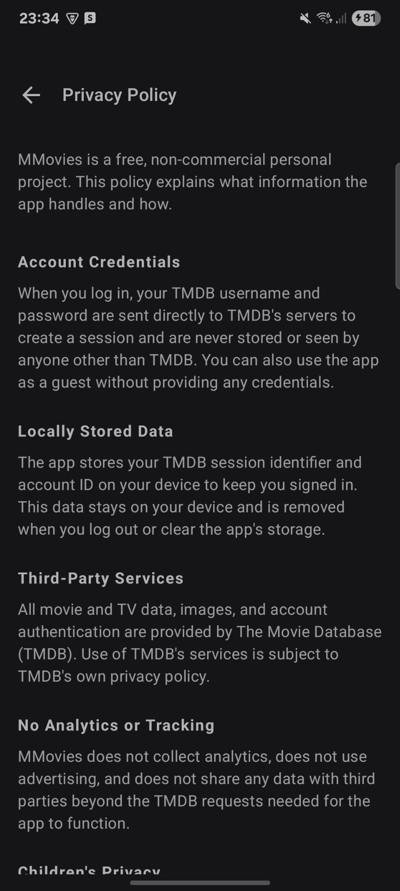
  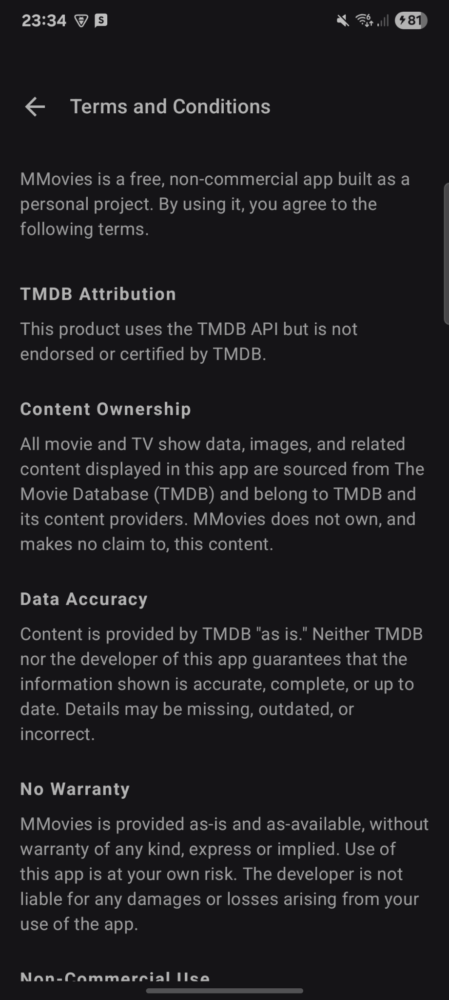
</p>

</details>

---

## License & Attribution

### TMDB

> This product uses the TMDB API but is not endorsed or certified by TMDB.

Movie, TV, person, artwork and trailer metadata is provided by [The Movie Database](https://www.themoviedb.org/).

TMDB content remains subject to:

- [TMDB Terms of Use](https://www.themoviedb.org/terms-of-use)
- [TMDB API Terms](https://www.themoviedb.org/api-terms-of-use)

### This project

Copyright © 2026 Boris Kunda. **All rights reserved.**

This repository is published for portfolio and reference purposes.

No license is granted to use, copy, modify or redistribute the application's source code beyond rights provided by GitHub's Terms of Service.

Third-party libraries remain subject to their respective licenses.

---

## Roadmap

- [ ] News section
- [ ] Improve landscape presentation
- [ ] Consolidate feature-specific result types
